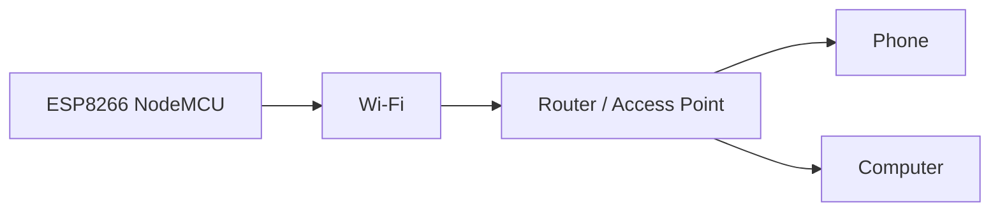
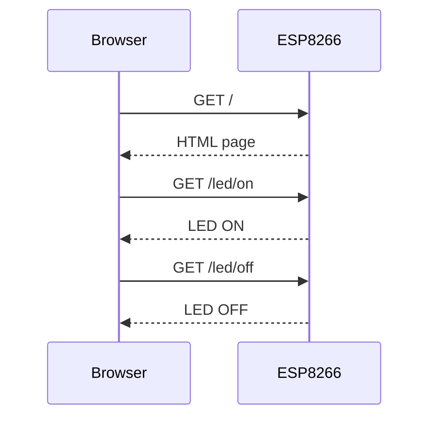

# 🌐 ESP8266 NodeMCU Complete Guide

[](https://www.espressif.com/en/products/socs/esp8266)
[](https://www.arduino.cc/)
[](https://isocpp.org/)
[](#-learning-roadmap)
[](LICENSE)

A professional, beginner-friendly repository for learning **ESP8266 NodeMCU** from hardware basics to Wi-Fi and IoT projects.

> **Target:** Common ESP8266 NodeMCU / ESP-12E style development boards. Exact pin labels can vary by board revision.

## 📚 Contents

- [What is ESP8266 NodeMCU?](#-what-is-esp8266-nodemcu)
- [Features](#-features)
- [Hardware](#-hardware)
- [Software](#-software)
- [Architecture](#-architecture)
- [Quick Start](#-quick-start)
- [Wi-Fi](#-wi-fi)
- [Web Server](#-web-server)
- [GPIO](#-gpio)
- [Learning Roadmap](#-learning-roadmap)
- [Troubleshooting](#-troubleshooting)
- [Projects](#-projects)
- [Security](#-security)

## 📌 What is ESP8266 NodeMCU?

The **ESP8266** is a microcontroller with built-in 2.4 GHz Wi-Fi. **NodeMCU** commonly refers to development boards based on the ESP8266 module that make programming easier by providing USB, USB-to-serial, voltage regulation, reset/flash controls, and convenient headers.

Simple idea:

> **NodeMCU = ESP8266 + Wi-Fi + easy development-board connections**

Typical uses:

- IoT projects
- Web servers
- Smart sensors
- Home-automation prototypes
- Remote device control
- Environmental monitoring

## ✨ Features

| Feature | Description |
|---|---|
| MCU | ESP8266 |
| Wireless | 2.4 GHz Wi-Fi |
| Programming | Arduino / ESP8266 SDK / PlatformIO |
| Digital I/O | Depends on board and pin usage |
| Analog | One ADC input on the ESP8266 |
| USB | Usually included on NodeMCU development boards |
| Logic | 3.3 V GPIO |

## 🗂️ Repository Structure

```text
ESP8266-NodeMCU-Guide/
├── README.md
├── LICENSE
├── .gitignore
├── docs/
│   ├── hardware.md
│   ├── software.md
│   ├── GPIO.md
│   ├── wifi.md
│   └── troubleshooting.md
├── examples/
│   ├── 01_serial_test/
│   ├── 02_builtin_led/
│   ├── 03_gpio_test/
│   ├── 04_wifi_test/
│   └── 05_web_server/
├── projects/
│   ├── wifi_led/
│   ├── temperature_monitor/
│   └── iot_dashboard/
└── images/
```

## 🧰 Hardware

Basic setup:

- ESP8266 NodeMCU
- USB data cable
- Computer
- Breadboard
- Jumper wires

Optional:

- LED + suitable resistor
- Push button
- Temperature/humidity sensor
- LDR/light sensor
- OLED
- Other compatible 3.3 V logic peripherals

## 💻 Software

Recommended for beginners:

1. Install Arduino IDE.
2. Install ESP8266 board support.
3. Select your NodeMCU board.
4. Connect USB.
5. Select the serial port.
6. Upload an example.
7. Open Serial Monitor at `115200`.

See [`docs/software.md`](docs/software.md).

## 🔌 Architecture

```text
                    ESP8266 NodeMCU
                           │
          ┌────────────────┼────────────────┐
          │                │                │
          ▼                ▼                ▼
        GPIO             Wi-Fi             ADC
          │                │                │
          ▼                ▼                ▼
    LEDs / Sensors     Router / AP       Analog Sensor
                           │
                    ┌──────┴──────┐
                    ▼             ▼
                  Phone          PC
```

## 🌐 Wi-Fi Flow



## 🚀 Quick Start

### 1. Clone

```bash
git clone https://github.com/YOUR-USERNAME/ESP8266-NodeMCU-Guide.git
cd ESP8266-NodeMCU-Guide
```

### 2. Serial test

Open:

```text
examples/01_serial_test/01_serial_test.ino
```

Use Serial Monitor at `115200` baud.

Expected:

```text
==============================
     ESP8266 NODEMCU TEST
==============================
NodeMCU started!
ESP8266 is running...
```

### 3. Built-in LED

Open:

```text
examples/02_builtin_led/02_builtin_led.ino
```

Many NodeMCU boards have an active-low onboard LED.

### 4. Wi-Fi

Open:

```text
examples/04_wifi_test/04_wifi_test.ino
```

Change:

```cpp
const char* ssid = "YOUR_WIFI_NAME";
const char* password = "YOUR_WIFI_PASSWORD";
```

The Serial Monitor will print the assigned IP address.

### 5. Web server

Open:

```text
examples/05_web_server/05_web_server.ino
```

After connecting, open the printed IP address in a browser on the same local network.

## 🌐 Web Server

The example provides simple LED controls:

```text
┌───────────────────────────────┐
│       ESP8266 NodeMCU         │
│                               │
│       Wi-Fi Web Server        │
│                               │
│       [ LED ON ]              │
│       [ LED OFF ]             │
└───────────────────────────────┘
```

Flow:



## 🔌 GPIO

Common NodeMCU labels:

| Label | GPIO | Notes |
|---|---:|---|
| D0 | GPIO16 | Digital I/O; special limitations |
| D1 | GPIO5 | Common I²C SCL |
| D2 | GPIO4 | Common I²C SDA |
| D3 | GPIO0 | Boot strap pin |
| D4 | GPIO2 | Built-in LED on many boards; boot strap pin |
| D5 | GPIO14 | Common SPI SCLK |
| D6 | GPIO12 | Common SPI MISO |
| D7 | GPIO13 | Common SPI MOSI |
| D8 | GPIO15 | Boot strap pin |
| RX | GPIO3 | UART RX |
| TX | GPIO1 | UART TX |
| A0 | ADC0 | Analog input |

> Always verify your exact board. GPIO0, GPIO2 and GPIO15 have boot-time requirements.

## 🧠 Learning Roadmap

```text
ESP8266 Basics
      ↓
Serial Monitor
      ↓
GPIO
      ↓
LED + Button
      ↓
Sensors
      ↓
Wi-Fi
      ↓
Web Server
      ↓
HTTP / API
      ↓
IoT Dashboard
      ↓
MQTT / Cloud
      ↓
Complete IoT Projects
```

## 🛠️ Troubleshooting

### Upload fails

Check:

- Correct board
- Correct serial port
- USB data cable
- USB driver
- Stable power
- External circuits are not interfering with boot pins

### Wi-Fi fails

Check:

- SSID
- Password
- 2.4 GHz network
- Signal strength
- Router settings
- Power stability

### Web server won't open

Check:

```text
ESP8266 connected?
       ↓
Correct IP?
       ↓
Same local network?
       ↓
Use http://IP_ADDRESS
       ↓
Network isolation disabled?
```

### Board resets

Check:

- Power
- Wiring
- Boot pins
- Sensor current
- Software crashes

## 📁 Projects

### Beginner

- Built-in LED
- External LED
- Button
- Analog light sensor
- Serial sensor reader

### Intermediate

- Wi-Fi LED controller
- Temperature monitor
- Web dashboard
- OLED display
- HTTP API

### Advanced

- MQTT sensor node
- Cloud data logging
- Multiple ESP8266 nodes
- Smart-home prototype

## 🔐 Security

Never commit:

- Wi-Fi passwords
- API keys
- Tokens
- Private server credentials

Do not expose an unsecured development web server to the public internet.

Use local configuration such as:

```text
secrets.h
.env
```

and keep these files out of Git.

## 🤝 Contributing

```bash
git checkout -b feature/my-example
git add .
git commit -m "Add new ESP8266 example"
git push origin feature/my-example
```

Then create a Pull Request on GitHub.

## 📜 License

MIT License. See [`LICENSE`](LICENSE).

## ⭐ Final Concept

Remember:

> **Read → Think → Connect → Control**

```text
Sensor
  ↓
ESP8266
  ↓
Wi-Fi
  ↓
Network
  ↓
Phone / PC / Dashboard
```

Happy building! 🚀🌐
